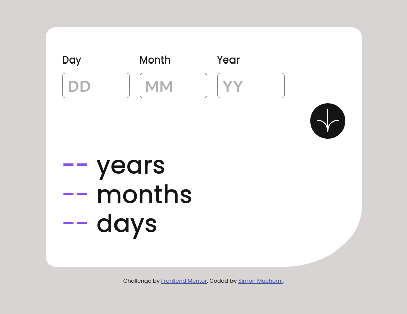
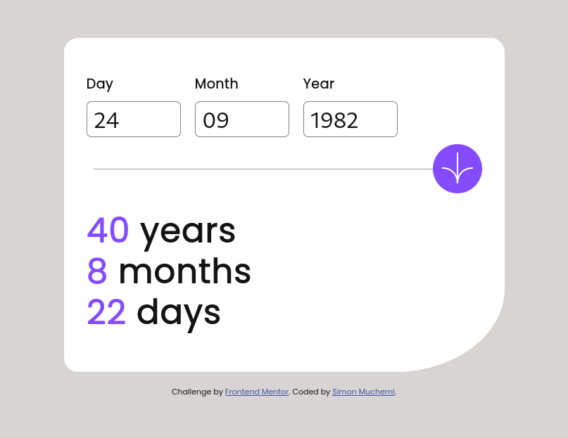
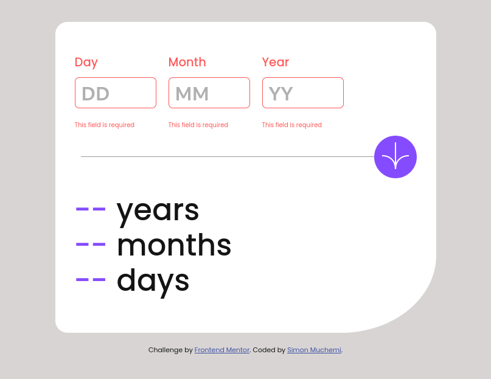
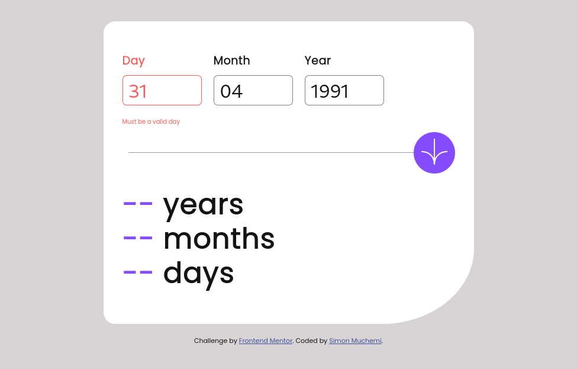

# Frontend Mentor - Age calculator app solution

This is a solution to the [Age calculator app challenge on Frontend Mentor](https://www.frontendmentor.io/challenges/age-calculator-app-dF9DFFpj-Q). Frontend Mentor challenges help you improve your coding skills by building realistic projects.

## Table of contents

- [Overview](#overview)
    - [The challenge](#the-challenge)
    - [Screenshot](#screenshot)
    - [Links](#links)
- [My process](#my-process)
    - [Built with](#built-with)
    - [What I learned](#what-i-learned)
    - [Continued development](#continued-development)
    - [Useful resources](#useful-resources)
- [Author](#author)
- [Acknowledgments](#acknowledgments)

## Overview

### The challenge

Users should be able to:

- View an age in years, months, and days after submitting a valid date through the form
- Receive validation errors if:
    - Any field is empty when the form is submitted
    - The day number is not between 1-31
    - The month number is not between 1-12
    - The year is in the future
    - The date is invalid e.g. 31/04/1991 (there are 30 days in April)
- View the optimal layout for the interface depending on their device's screen size
- See hover and focus states for all interactive elements on the page

### Screenshot
#### Desktop Preview

#### Valid inputs

#### Error state (empty inputs)

#### Error state (invalid input)

#### Mobile

### Links

- Solution URL: [GitHub](https://github.com/Simon-Muchemi/age-calculator-app)
- Live Site URL: [vercel app](https://age-calculator-app-wheat.vercel.app/)

## My process

### Built with

- Semantic HTML5 markup
- CSS custom properties
- CSS Grid
- Mobile-first workflow
### What I learned
I learned about gaps; they are used to add spaces between elements. I also learnt how to remove the scroll bar on an input type number HTML element.

1. css gaps
```html
 <div class="inputs">
  <div class="day-input">
    <label>
      <p class="label-text" id="day-label">Day</p>
      <input type="number" id="day" placeholder="DD">
    </label>
    <p class="error" id="day-error" style="display: none">This field is required</p>
  </div>
  <div class="month-input">
    <label>
      <p class="label-text" id="month-label">Month</p>
      <input type="number" id="month" placeholder="MM">
    </label>
    <p class="error" id="month-error" style="display: none"><small>This field is required</small></p>
  </div>
  <div class="year-input">
    <label>
      <p class="label-text" id="year-label">Year </p>
      <input type="number" id="year" placeholder="YY">
    </label>
    <p class="error" id="year-error" style="display: none">This field is required</p>
  </div>
</div>
<style>
.inputs{
  display: flex;
  flex-direction: row;
  font-size: 15px;
  gap: 20px;
}
</style>
```
2. Removing scroll bar on html input type number element
```html
<style>
  .inputs input{
    -moz-appearance: textfield;
  } /*For chrome browser*/
  input::-webkit-outer-spin-button,
  input::-webkit-inner-spin-button {
    -webkit-appearance: none;
    margin: 0;
  }/*for firefox browser*/
</style>
```
If you want more help with writing markdown, we'd recommend checking out [The Markdown Guide](https://www.markdownguide.org/) to learn more.

### Continued development

Use this section to outline areas that you want to continue focusing on in future projects. These could be concepts you're still not completely comfortable with or techniques you found useful that you want to refine and perfect.

### Useful resources

- [openAI](https://chat.openai.com/share/d9b0fdc4-036a-4412-8248-62e4cc63ffc9) - This helped me in removing the HTML input type number scroll bar
- [w3schools](https://www.w3schools.com/default.asp) - This site acted as a refresher to me. I'd recommend it to anyone still learning this concept.

## Author

- Github - [Simon Muchemi](https://github.com/Simon-Muchemi)
- Frontend Mentor - [@Simon-Muchemi](https://www.frontendmentor.io/profile/Simon-Muchemi)
- Twitter - [@SymonMuchemi](https://www.twitter.com/SymonMuchemi)

## Acknowledgments
I would like to thank the frontend mentor community for the task. It has been fun coding and learning how to solve it.

